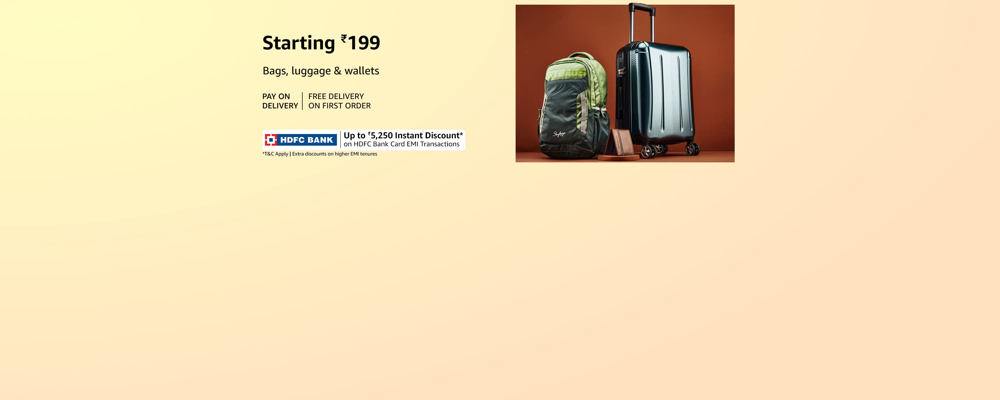

#HTML

```index.HTML
<!DOCTYPE html>
<html lang="en">
<head>
    <meta charset="UTF-8">
    <meta name="viewport" content="width=device-width, initial-scale=1.0">
    <title>Amazon</title>
    <link rel="stylesheet" href="https://cdnjs.cloudflare.com/ajax/libs/font-awesome/6.5.1/css/all.min.css" integrity="sha512-DTOQO9RWCH3ppGqcWaEA1BIZOC6xxalwEsw9c2QQeAIftl+Vegovlnee1c9QX4TctnWMn13TZye+giMm8e2LwA==" crossorigin="anonymous" referrerpolicy="no-referrer" />
    <link rel="stylesheet" href="style.css">
</head>
<body>
    <header>
        <!-- BOX-1 -->
        <div class="Navbar">
            <div class="Nav-logo border">
                <!--  -->
            </div>
            <!-- BOX-2 -->
            <div class="Nav-add border">
                    <p class="add-one">Delivering to Mumbai 400001</p>
                
                    <div class="location-sym">
                        <i class="fa-sharp fa-solid fa-location-dot" style="color: #ffffff;"></i>

                        <p class="add-two">Update Location</p>
                    </div>   
            </div>
            <!-- BOX-3 -->

            <div class="Nav-search border" >
                <select class="search-select">
                    <option >All</option> 
                    <option >Alexa Skills</option> 
                    <option >Amazon Devices</option> 
                    <option >Amazon Fashion</option> 
                    <option >Amazon Fresh Meat</option> 
                    <option >Amazon pharmacy</option> 
                    <option >App and Games</option> 
                    <option >Audio Books</option> 
                    <option >Baby</option> 
                    <option >Books</option> 
                    <option >Car and Motarbikes</option> 
                    <option >Clothing and Accessories</option> 
                    <option >Computer Accessories</option> 
                    <option >Deals</option> 
                    <option >Electronics</option> 
                    <option >Furniture</option> 
                    
                </select>
                <input placeholder="Search Amazon.in" class="search-input">
                <div class="searchIcon"><i class="fa-solid fa-magnifying-glass"></i>
                </div>
            </div>

            <!-- BOX-4 -->
            <div class="Nav-region">
                <select class="Language">
                    <option id="eng">ENG</option>
                    <option id="hin">HIN</option>
                    <option id="mar">MAR</option>
                    <option id="frn">FRN</option>
                    <option id="tam">TAM</option>
                </select>
            </div>

            <!--BOX-5 -->

            <div class="signin border">
                <span>Hello, Sign in</span>
                <p class="accountOrder">Account & Lists</p>
            </div>

            <!-- BOX-6 -->
            <div class="return border">
                <span>Returns</span>
                <p class="accountOrder">& Orders</p>
            </div>

            <div class="addtocart border">
                <i class="fa-solid fa-cart-shopping" id="cart" style="color: #ffffff;"></i>
                <!-- <p class="accountOrder" id="cartText">Cart</p> -->
            </div>

        </div>

        <div class="Nav-menu">
            <!-- BOX-1 -->
                
        <div id="sidebar">

        <div id="toggle-btn" onclick="show()" class="allInfo">
        <i class="fa-solid fa-bars"> All</i>
        </div>
        
        <span>HELLO, Sign up</span>
        <ul class="sidebarUl">
            
        <li><a href="">Home</a></li>
        <li><a href="">Contact</a></li>
        <li><a href="">About</a></li>
        <li><a href="">Details</a></li>
        </ul>
        
        </div>
        

            <!-- BOX-2 -->
            <div class="Nav-shop">

            <div class="minitv border">
                <a href="#" class="tv">
                    Amazon miniTV
                </a>
            </div>
            <div class="shop border">
                <p>Sell</p>
            </div>

            <div class="shop border">
                <p>Best Sellers</p>
            </div>

            <div class="shop border">
                <p>Todays Deals</p>
            </div>

            <div class="shop border">
                <p>Mobiles</p>
            </div>

            <div class="shop border">
                <p>Electronics</p>
            </div>

            <div class="shop border">
                <p>Customer Service</p>
            </div>
            
            <div class="shop border">
                <select id="prime">
                    <option >Prime</option>
                </select>
            </div>

            <div class="shop border">
                <p>Gift Ideas</p>
            </div>

            <div class="shop border">
                <p>New Release</p>
            </div>

            <div class="shop border">
                <p>Home & kitchen</p>
            </div>

            <div class="shop border">
                <p>Fashion</p>
            </div>

            
            
            </div>
        </div>

    </header>

        <!-- Heroic section -->

        <div id="hero-section" class="slider">
            <!-- <div class="slider"> -->

                <div class="slides">
                
                

                

                
                
                
                
                
                
                </div>
                
                <button class="prev" onclick="prevSlide()">&#10094</button>
                
                <button class="next" onclick="nextSlide()">&#10095</button>
                
                <!-- </div> -->
            <div class="hero-msg">You are on amazon.com. You can also shop on Amazon India for millions of products with fast local delivery.  <a > Click here to go to Amazon.in</a></div>
            
        </div>
        
        <div class="shop_content">

            <div class="box">
                <div class="boxmaterial">
                    <h2>Bags</h2>
                    <div class="box_img" style="background-image: url(img_01.jpg);"></div>
                    <p style="color: #007185;">see more</p>
                </div>
            </div>

            <div class="box">
                <div class="boxmaterial">
                    <h2>Shoes</h2>
                    <div class="box_img" style="background-image: url(img_003.jpg);"></div>
                    <p style="color: #007185;">see more</p>
                </div>
            </div>
            
            <div class="box">
                <div class="boxmaterial">
                    <h2>Electronics</h2>
                    <div class="box_img" style="background-image: url(img_08.jpg);"></div>
                    <p style="color: #007185;">see more</p>
                </div>
            </div>
            <div class="box">
                <div class="boxmaterial">
                    <h2>Clothing</h2>
                    <div class="box_img" style="background-image: url('img_04.jpg');"></div>
                    <p style="color: #007185;">see more</p>
                </div>
            </div>

            <div class="box">
                <div class="boxmaterial">
                    <h2>Air-Purifying Plants</h2>
                    <div class="box_img" style="background-image: url(img_06.jpg);"></div>
                    <p style="color: #007185;">see more</p>
                </div>
            </div>
            <div class="box">
                <div class="boxmaterial">
                    <h2>Makeup Picks</h2>
                    <div class="box_img" style="background-image: url(img_05.jpg);"></div>
                    <p style="color: #007185;">see more</p>
                </div>
            </div>
            <div class="box">
                <div class="boxmaterial">
                    <h2>Toys</h2>
                    <div class="box_img" style="background-image: url(img_07.jpg);"></div>
                    <p style="color: #007185;">see more</p>
                </div>
            </div>

            <div class="box">
                <div class="boxmaterial">
                    <h2>Mens Accessories</h2>
                    <div class="box_img" style="background-image: url(img_02.jpg);"></div>
                    <p style="color: #007185;">see more</p>
                </div>
            </div>
            

        </div>


    <footer>
        <div class="footer-content-1">
            <p>Back to top</p>
        </div>
        <div class="footer-content-2">

            <ul>
                <p class="foot-text">Get to Know Us</p>
                <a href="#">About Us</a>
                <a href="#">Careers</a>
                <a href="#">Press Releases</a>
                <a href="#">Amazon Science</a>
            </ul>
            <ul>
                <p class="foot-text">Connect with Us</p>
                <a href="#">Facebook</a>
                <a href="#">Instagram</a>
                <a href="#">Twitter</a>
            </ul>
            <ul>
                <p class="foot-text">Make Money with Us</p>
                <a href="#">Sell on Amazon</a>
                <a href="#">Sell under Amazon Accelerator</a>
                <a href="#">Protect and Build Your Brand</a>
                <a href="#">Amazon Global Selling</a>
                <a href="#">Become an Affiliate</a>
                <a href="#">Fulfilment by Amazon</a>
                <a href="#">Advertise Your Products</a>
                <a href="#">Amazon Pay on Merchants</a>
            </ul>
            <ul>
                <p class="foot-text">Let Us Help You</p>
                <a href="#">COVID-19 and Amazon</a>
                <a href="#">Your Account</a>
                <a href="#">Returns Centre</a>
                <a href="#">Help</a>
            </ul>
        </div>

            <div class="footer-content-3">
                
            </div>

            <div class="footer-content-4">
                <div class="foot-first">Conditions of Use & Sale
                    Privacy Notice
                    Interest-Based Ads</div>
                
                <div class="foot-sec"></div1996-2024><i class="fa-regular fa-copyright"></i> Amazon.com, Inc. or its affiliates>
            </div>
    </footer>

    <script src="script.js"></script>
</body>
</html>
```
